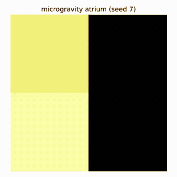
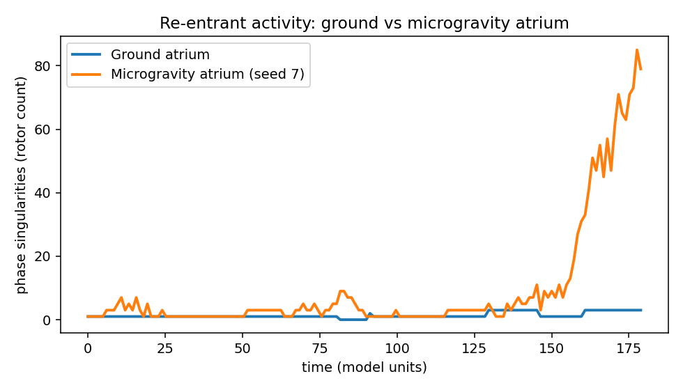

# Atrial fibrillation in microgravity — an in-silico model 🛰️🫀

*Does the atrial remodelling caused by spaceflight lower the threshold for, and sustain,
fibrillatory re-entry?*

A compact, tested **reaction–diffusion** model of an atrial tissue sheet that asks an
original question at the intersection of **cardiac electrophysiology** and **space
medicine**: when microgravity remodels the atrium — dilating it, seeding fibrosis, and
shortening refractoriness — how does the dynamics of atrial fibrillation (AF) change?

It is built from first principles (PDEs solved numerically), runs on a laptop in
minutes, and is honest about what a minimal model can and cannot claim.

| Ground atrium (1g) | Microgravity-remodelled atrium |
|:---:|:---:|
|  |  |
| A single organised rotor | Fragmentation into multiple wandering wavelets |



---

## The question

Long-duration spaceflight is gated by cardiovascular risk. In microgravity the heart
undergoes documented remodelling: **headward fluid shift** raises atrial filling and
**dilates** the chamber; deconditioning and altered loading promote **structural
remodelling / fibrosis**; and **autonomic shifts** shorten atrial refractoriness.
Each of these is, on the ground, independently pro-arrhythmic. Astronaut atrial size
and AF risk are an active clinical concern (Khine et al., 2018).

This project turns that qualitative worry into a runnable model and a measurable
outcome: **how many simultaneous rotors (re-entry circuits) does the tissue sustain?**

## The model

A two-variable **Aliev–Panfilov** monodomain model on a 2-D sheet:

```
du/dt = ∇·(D ∇u) − k·u·(u − a)·(u − 1) − u·v
dv/dt = (ε₀ + μ₁·v/(u + μ₂))·(−v − k·u·(u − a − 1))
```

- `u` — fast transmembrane potential, `v` — slow recovery variable.
- `D` is a **spatial field**, so fibrosis is modelled as patches of low cell-to-cell
  coupling (finite-volume operator with harmonic-mean face conductances, no-flux
  boundaries).
- Integrated with explicit Euler under an enforced diffusion-stability bound.

Re-entry is seeded deterministically with a **broken wavefront** (left half
depolarised, top half held refractory), which curls into exactly **one** rotor — so any
*additional* rotors that appear are attributable to the tissue substrate, not the
stimulus.

### Microgravity remodelling → model parameters

Each mapping is a deliberately simple, individually toggleable hypothesis
(`src/afib_microgravity/remodeling.py`):

| Spaceflight change | Mechanism | Model representation |
|---|---|---|
| Atrial dilation | headward fluid shift ↑ filling | larger grid (more wavelengths fit) |
| Fibrosis | deconditioning / loading | random low-`D` patches |
| Electrical remodelling | autonomic shift, ↓ refractoriness | faster recovery (`ε₀` ↑) |

## Results

Rotors are counted as **phase singularities** (the topological-charge loop-integral
method) and reported as **density** (per 10⁴ cells, to correct for the dilated atrium's
larger area), averaged over the second half of each run. The microgravity substrate is
random, so the headline is a **6-seed fibrosis ensemble** at full duration, not a single
run.

| Condition | Rotor density (per 10⁴ cells) | Mean rotors | Across substrates |
|---|:---:|:---:|:---:|
| Ground (deterministic) | **0.37** | 1.8 | — |
| Microgravity (n=6) | **0.85** | 6.9 ± 6.8 | **1.5 – 16.7** |

**Headline: ~2.3× higher rotor density in the remodelled atrium** — but the more
interesting result is the **variance**. Two of six fibrosis realisations tipped into
*sustained fibrillation* (16+ rotors, peaks > 50), while the others sustained only a few
extra wavelets. The microgravity substrate doesn't uniformly cause AF; it creates a
**bimodal, substrate-dependent vulnerability** — which mirrors the clinical reality that
fibrosis *pattern*, not just burden, gates AF. That variance is the finding, not noise.

Numbers and the full per-seed breakdown are written to `figures/results.json`, fully
reproducible from the experiment script.

## Run it

```bash
pip install -r requirements.txt
pytest                                      # 10 fast, deterministic tests
python experiments/run_baseline_vs_microgravity.py   # ~3 min, writes figures/
```

## Repository layout

```
src/afib_microgravity/
  model.py        # Aliev–Panfilov sheet, variable-D finite-volume diffusion
  protocols.py    # broken-wavefront seed, S1–S2 cross-field induction
  remodeling.py   # microgravity → parameter mappings (the scientific core)
  metrics.py      # phase singularities, conduction velocity, dominant frequency
  viz.py          # snapshots, animations, time-series plots
experiments/      # the baseline-vs-microgravity study
tests/            # model stability, propagation, detector correctness, mappings
```

## Scientific honesty / limitations

This is a **hypothesis-generating** model, not a validated quantitative prediction.

- The Aliev–Panfilov model is dimensionless and generic; it is *not* an ionically
  detailed atrial model, and parameters are not fit to human atrial data.
- The remodelling mappings are caricatures chosen for transparency, not measured
  microgravity–tissue relationships. Magnitudes are illustrative.
- It is a 2-D monodomain sheet: no realistic atrial geometry, fibre anisotropy,
  pulmonary-vein triggers, or bidomain effects.
- The microgravity result is high-variance; the ensemble is small (n=6). Treat the
  *direction* and the *substrate-dependence* as the takeaways, not the exact factor.
- References below should be independently verified before any formal citation.

Natural next steps: fit to a published atrial action potential (e.g. Courtemanche or
Nygren), use realistic fibrosis textures, add fibre anisotropy, and a larger ensemble
with confidence intervals.

## References

- Aliev RR, Panfilov AV. *A simple two-variable model of cardiac excitation.* Chaos,
  Solitons & Fractals. 1996;7(3):293–301.
- Gray RA, Pertsov AM, Jalife J. *Spatial and temporal organization during cardiac
  fibrillation.* Nature. 1998;392:75–78. (phase singularities / rotors)
- Khine HW, et al. *Effects of prolonged spaceflight on atrial size, atrial
  electrophysiology, and risk of atrial fibrillation.* Circ Arrhythm Electrophysiol.
  2018. (astronaut AF risk)
- Garrett-Bakelman FE, et al. *The NASA Twins Study.* Science. 2019;364:eaau8650.

## Author

**Laura Piñero Roig** — Medicine (UB) · Mathematics & Physics (UAB) · La Caixa Fellow.
Built at the intersection of cardiac electrophysiology, numerical physics, and space
medicine.

*MIT licensed.*
