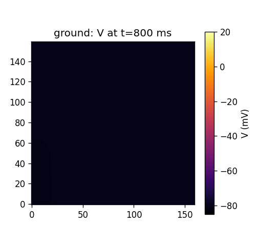
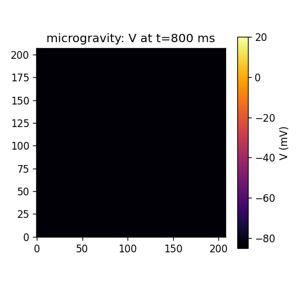
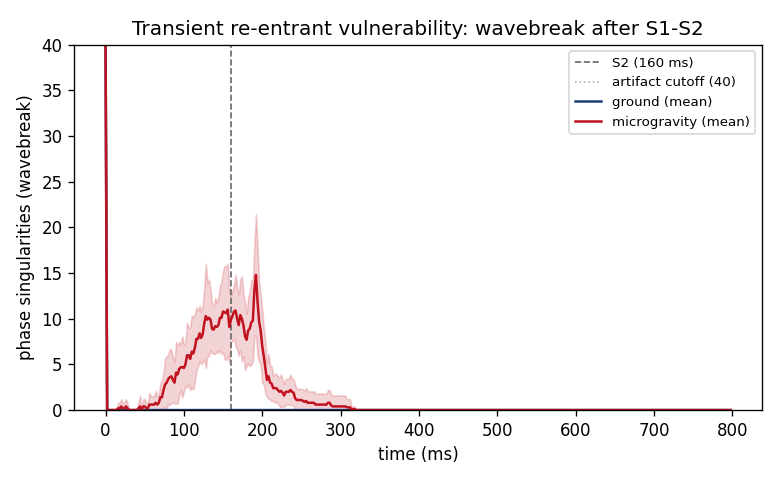

# Atrial fibrillation in microgravity — an in-silico human-atrial model 🛰️🫀

[](https://github.com/laurapiro17/atrial-fib-in-microgravity/actions/workflows/tests.yml)
[](https://www.python.org/)
[](LICENSE)

*Does the atrial remodelling caused by spaceflight increase the tissue's vulnerability
to re-entry?*

A tested, reproducible 2-D model of **human atrial tissue** at the intersection of
**cardiac electrophysiology** and **space medicine**. It uses the validated
**Courtemanche–Ramirez–Nattel (CRN)** ionic action-potential model on a fibre-oriented
monodomain sheet, and asks whether microgravity-type remodelling — dilation, fibrosis,
shortened refractoriness — makes the atrium fragment wavefronts into re-entrant rotors.

> **Headline (validated).** Healthy tissue conducts an induced wavefront cleanly
> (0 wavebreak in 10/10 fibrosis realisations). The microgravity-remodelled substrate
> fragments wavefronts into transient phase singularities — wavebreak burden
> **1192 PS·ms (95% CI 1031–1319), in 10/10 realisations**. The activity is *transient*
> (it self-terminates); we do **not** claim sustained fibrillation. This matches the
> clinical picture: increased vulnerability without observed sustained AF
> (Khine et al., 2018).

| Ground atrium (1 g) | Microgravity-remodelled atrium |
|:---:|:---:|
|  |  |
| wavefront conducts cleanly | wavefront fragments into rotor cores |



---

## The question

Long-duration spaceflight is gated by cardiovascular risk. In microgravity the heart
remodels: a **headward fluid shift** raises atrial filling and dilates the chamber;
deconditioning promotes **interstitial fibrosis**; and autonomic shifts **shorten atrial
refractoriness**. Each is independently pro-arrhythmic on Earth. Khine et al. (2018)
found, in astronauts, transient left-atrial enlargement (12 ± 18 mL) and
electrophysiological change consistent with increased atrial-fibrillation (AF) risk —
but **no sustained AF**. We test the mechanism: does this remodelling lower the re-entry
threshold, and which component drives it?

## The model

- **Ionics:** Courtemanche–Ramirez–Nattel human atrial action potential (21 state
  variables, 12 currents), integrated with Rush–Larsen gating. Validated against
  published biomarkers (resting ≈ −81 mV, APD₉₀ ≈ 290–300 ms at 1 Hz, upstroke
  > 100 V/s).
- **Tissue:** 2-D monodomain, operator-split (reaction then explicit finite-volume
  diffusion). Orthotropic 3:1 conduction; longitudinal diffusion calibrated so planar
  **conduction velocity ≈ 58 cm/s** (physiological human atrium); dx = 0.25 mm; no-flux
  boundaries. An optional **Numba** kernel gives ≈9× speed-up, validated identical to
  the NumPy reference to 1e-13.
- **Fibrosis:** spatially correlated low-coupling Gaussian-random-field patches.

### Microgravity remodelling → model parameters

Each mapping is individually toggleable (`src/afib_microgravity/remodeling.py`):

| Spaceflight change | Mechanism | Model representation |
|---|---|---|
| Shortened refractoriness | AF-type electrical remodelling | I_CaL ↓70%, I_to ↓50%, I_Kur ↓50%, I_K1 ↑100% → APD₉₀ 294 → 135 ms |
| Interstitial fibrosis | deconditioning / loading | correlated low-coupling patches |
| Atrial dilation | headward fluid shift ↑ filling | enlarged sheet (anchored to Khine +12 mL) |

## Results

An S1–S2 cross-field protocol probes re-entrant vulnerability across a fibrosis-seed
ensemble. Wavefront fragmentation is the **wavebreak burden**: the artifact-rejected,
time-integrated count of phase singularities (rotor cores), via the topological-charge
method on a delayed-V phase field. Bootstrap 95% CIs over seeds.

| Condition | Wavebreak burden (PS·ms) | Peak PS | Seeds with wavebreak |
|---|:---:|:---:|:---:|
| Ground | **0** (CI 0–0) | 0 | **0 / 10** |
| Microgravity | **1192** (CI 1031–1319) | 17.9 (14.8–21.2) | **10 / 10** |

**Two controls make the result trustworthy (not an artifact):**
- **Detector specificity** (`tests/test_ps_detector.py`): the rotor counter returns
  exactly 1 on a single spiral and 0 on planar / static-step fields.
- **Artifact control** (`experiments/artifact_control.py`): with a single S1 and **no
  induced re-entry**, the fibrotic substrate shows **zero** phase singularities once the
  wave clears — so the headline count is genuine wave fragmentation, not edge artifact.

Supporting analyses: mechanism isolation (which driver dominates), vulnerable-window
width, APD-restitution slope, fibrosis-density threshold, and a sensitivity analysis
(robustness to the artifact threshold and conduction calibration).

## Run it

```bash
python -m venv .venv && source .venv/bin/activate
pip install -e ".[dev]"          # numpy, scipy, matplotlib, pytest (+ optional numba)
pytest                            # fast, deterministic tests incl. detector specificity
python experiments/validate_single_cell.py        # CRN AP biomarkers
python experiments/ensemble_with_ci.py --full     # headline ensemble (long; writes figures/)
```

## Repository layout

```
src/afib_microgravity/
  crn.py / crn_numba.py  # CRN human-atrial ionics (NumPy + Numba kernels)
  cell_model.py          # CellModel interface (CRN and Aliev–Panfilov interchangeable)
  diffusion.py           # anisotropic finite-volume div(D grad V)
  model.py               # MonodomainSheet (operator splitting) + legacy AP sheet
  fibrosis.py            # correlated low-coupling field
  remodeling.py          # microgravity → CRN parameter mappings
  restitution.py         # APD / CV restitution (S1–S2)
  metrics.py             # phase singularities, wavebreak burden, bootstrap CI
experiments/             # validation, ensemble, mechanism panel, vulnerable window, ...
docs/preprint/           # manuscript + Computing-in-Cardiology draft
tests/                   # ionic biomarkers, diffusion, detector specificity, ...
```

A minimal dimensionless **Aliev–Panfilov** model is retained behind the same interface
for fast tests and as a qualitative comparison; the scientific results above use the CRN
ionic model.

## Scientific honesty / limitations

This is a **hypothesis-generating** model, not a clinical prediction.

- 2-D monodomain sheet: no 3-D atrial geometry, no bidomain effects, no pulmonary-vein
  triggers.
- The microgravity → ionic mappings are *directional* hypotheses (the documented
  AF-remodelling direction), not measured microgravity tissue relationships; magnitudes
  are illustrative.
- The result is **transient re-entrant vulnerability**, not sustained AF. Sustained
  multi-wavelet AF is not reproduced — at physiological wavelengths the required domain
  exceeds laptop compute — and forcing it would need non-physiological parameters.
- References below should be independently verified before formal citation.

## References

- Courtemanche M, Ramirez RJ, Nattel S. *Ionic mechanisms underlying human atrial action
  potential properties.* Am J Physiol. 1998;275(1):H301–21.
- Khine HW, et al. *Effects of prolonged spaceflight on atrial size, atrial
  electrophysiology, and risk of atrial fibrillation.* Circ Arrhythm Electrophysiol.
  2018;11(5):e005959. (PMID 29752376.)
- Rush S, Larsen H. *A practical algorithm for solving dynamic membrane equations.* IEEE
  Trans Biomed Eng. 1978;25(4):389–92.
- Gray RA, Pertsov AM, Jalife J. *Spatial and temporal organization during cardiac
  fibrillation.* Nature. 1998;392:75–78.

## Author

**Laura Piñero Roig** — Medicine (UB) · Mathematics & Physics (UAB, 1st year) · La Caixa
Fellow. ORCID [0009-0008-3390-4029](https://orcid.org/0009-0008-3390-4029). Built at the
intersection of cardiac electrophysiology, numerical physics, and space medicine.

*MIT licensed. Cite via [`CITATION.cff`](CITATION.cff).*
